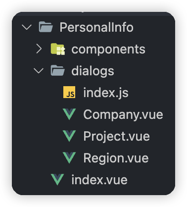

# nice-dialog-vue2

## 简介

仿照 NiceModal 实现的，vue2 版 NiceDialog。

> 灵感来源 [NiceModalReact](https://github.com/eBay/nice-modal-react)。

> 对[@xekin](https://juejin.cn/user/1714893869023960/posts)这篇文章[Vue2 Dialog 弹窗函数式调用最佳实践](https://juejin.cn/post/7188056420212801591)的实现。

代码借鉴了[Vue2 Dialog 弹窗函数式调用最佳实践](https://juejin.cn/post/7188056420212801591)。
功能没[NiceModalReact](https://github.com/eBay/nice-modal-react)那么强大，只是用法相似。

## 主要功能

### 基本使用

父组件使用

```jsx
import Vue from 'vue';
import NiceDialog from 'NiceDialog';
import Dialog from './dialog.vue';

const dialogInstance = NiceDialog.create(Dialog, undefined, Vue);

export default {
  methods: {
    onOpen() {
      dialogInstance.open(undefined, this);
    }
  }
};
```

子组件（dialog）

```jsx
<template>
  <el-dialog title="提示" :visible="visible" @close="onClose">
    这是一段信息
    <template #footer >
      <el-button @click="onClose">取 消</el-button>
      <template-button type="primary" @click="onClose">确 定</el-button>
    </template>
  </el-dialog>
</template>

<script>
export default {
  data() {
    return {
      visible: false
    };
  },

  methods: {
    onClose() {
      this.visible = false;
    },
  }
};
</script>
```

### 带参数

父组件使用

```jsx
import Vue from 'vue';
import NiceDialog from 'NiceDialog';
import Dialog from './dialog.vue';

const dialogInstance = NiceDialog.create(Dialog, undefined, Vue);

export default {
  methods: {
    onOpen() {
      dialogInstance.open({ title: '明天', content: '你好' }, this);
    }
  }
};
```

子组件（dialog）

```jsx
<template>
  <el-dialog :title="title" :visible="visible" @close="onClose">
    {{ content }}
    <template #footer>
      <el-button @click="onClose">取 消</el-button>
      <template-button type="primary" @click="onClose">确 定</el-button>
    </template>
  </el-dialog>
</template>

<script>
export default {
   props: {
    title: {
      type: String,
      default: ''
    },

    content: {
      type: String,
      default: ''
    }
  },

  data() {
    return {
      visible: false
    };
  },

  methods: {
    onClose() {
      this.visible = false;
    },
  }
};
</script>
```

### 打开、关闭时。是否销毁、重新创建组件。还是只改变 visible。

create 加上 destroy 参数。

父组件使用

```jsx
import Vue from 'vue';
import NiceDialog from 'NiceDialog';
import Dialog from './dialog.vue';

const dialogInstance = NiceDialog.create(Dialog, { destroy: false }, Vue);

export default {
  methods: {
    onOpen() {
      dialogInstance.open({ title: '明天', content: '你好' }, this);
    }
  }
};
```

### 一次构建多个 Dialog 实例

```jsx
import Vue from 'vue';
const [Test1, Test2, Test3, Test4] = NiceDialog.create([Test, Test, Test, Test], undefined, Vue);
```

### 实际项目中的使用



这个是**个人信息**的页面，其中`index.vue`里有个表格。

表格“操作”列中，使用三个按钮触发，弹出不同弹窗；如下。

- Project.vue [项目信息]
- Company.vue  [机构信息]
- Region.vue [地址信息]

dialog/index.js

```jsx
import Vue from 'vue';
import NiceDialog from 'NiceDialog';

import Project from './Project.vue';
import Region from './Region.vue';
import Company from './Company.vue';

export const [CompanyDialog, ProjectDialog, RegionDialog] = NiceDialog.create(
  [Company, Project, Region],
  { destroy: false },
  Vue
);
```

index.vue

```jsx
import { CompanyDialog, ProjectDialog, RegionDialog } from './dialogs';

export default {
  methods: {
    onOpenCompany() {
      CompanyDialog.open({ title: '公司信息' }, this);
    },
    onOpenProject() {
      ProjectDialog.open({ title: '项目信息' }, this);
    },
    onOpenRegionDialog() {
      RegionDialog.open({ title: '地址信息' }, this);
    }
  }
};
</script>

```

代码在`/example/src/components/Reality/PersonalInfo`。
